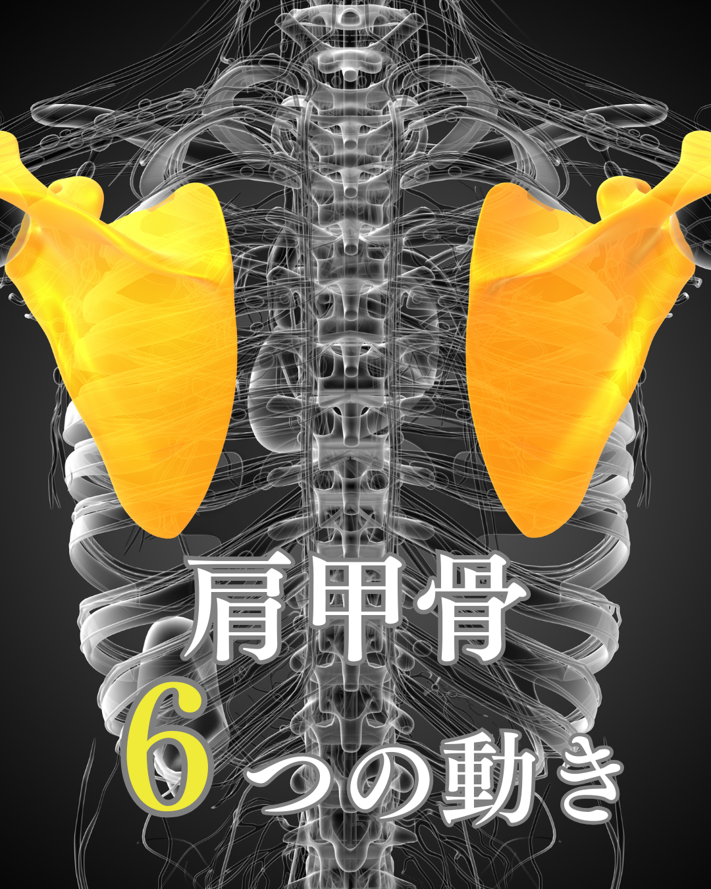

# 2026年9月20日 国家試験勉強

## 肩甲骨の6つの動き

> 画像出典：[肩甲骨の6つの動き｜HALU鍼灸整骨院 池田院](https://halu-shinkyu.net/ikeda/blog/uncategorized/%E8%82%A9%E7%94%B2%E9%AA%A8%E3%81%AE6%E3%81%A4%E3%81%AE%E5%8B%95%E3%81%8D/)

ウェブ検索で複数の解剖学資料を照合しました。資料によって「補助筋をどこまで含めるか」に多少差があるので、**理学療法士国家試験で押さえたい主要筋を中心に、補助的に働く筋も含めて**整理します。([StatPearls][1])

| 肩甲骨の運動 | 作用する筋 |
|---|---|
| **① 挙上** ↑ | **僧帽筋上部、肩甲挙筋、大菱形筋、小菱形筋** |
| **② 下制** ↓ | **僧帽筋下部、小胸筋、鎖骨下筋、広背筋、大胸筋（胸肋部）、前鋸筋下部** |
| **③ 内転（後退）** ←→ | **僧帽筋中部、大菱形筋、小菱形筋**、広背筋 |
| **④ 外転（前方突出）** →← | **前鋸筋、小胸筋**、大胸筋 |
| **⑤ 上方回旋** ↗ | **僧帽筋上部＋僧帽筋下部＋前鋸筋** |
| **⑥ 下方回旋** ↘ | **肩甲挙筋、大菱形筋、小菱形筋、小胸筋**、広背筋、大胸筋（胸肋部） |

特に**国試で重要な組み合わせ**に絞ると、こう覚えるのがおすすめです。([AHQS][2])

### 挙上

→ 僧帽筋上部・肩甲挙筋・菱形筋

### 下制

→ 僧帽筋下部・小胸筋

### 内転

→ **僧帽筋中部・菱形筋**

### 外転

→ **前鋸筋・小胸筋**

### 上方回旋

→ ⭐ **僧帽筋上部・下部＋前鋸筋**

### 下方回旋

→ **菱形筋・肩甲挙筋・小胸筋**

## 特に覚えてほしい「3セット」

国試では筋肉を単独で覚えるより、以下のセットがかなり重要です。

### ① 菱形筋

→ **挙上・内転・下方回旋**

### ② 前鋸筋

→ **外転・上方回旋**

### ③ 僧帽筋

- 上部：**挙上・上方回旋**
- 中部：**内転**
- 下部：**下制・上方回旋**

特に**「上方回旋＝僧帽筋上部＋僧帽筋下部＋前鋸筋」**はフォースカップルを形成する組み合わせで、第60回理学療法士国家試験でも僧帽筋下部線維―上方回旋が問われています。([AHQS][2])

ちなみに、先ほど質問してくれた**菱形筋＝「挙上・内転・下方回旋」**の3つ、と覚えると非常に整理しやすいです。([ボディ・モーション・ラボ][3])

[1]: https://www.statpearls.com/point-of-care/32535 "Anatomy, Back, Scapula | Treatment & Management | Point of Care"
[2]: https://ahq-study.com/riyutoku/study/rigaku/P60P069.html?from=year "肩甲骨の筋と運動の組合せで正しいのはどれか。｜第60回理学療法士国家試験（2025）午後 問69｜理由で解く 理学療法士"
[3]: https://nobiru-karada.com/shoulder-girdle-elevation-depression-muscles "肩甲骨の挙上と下制に作用する筋肉のまとめ｜ボディ・モーション・ラボ"
