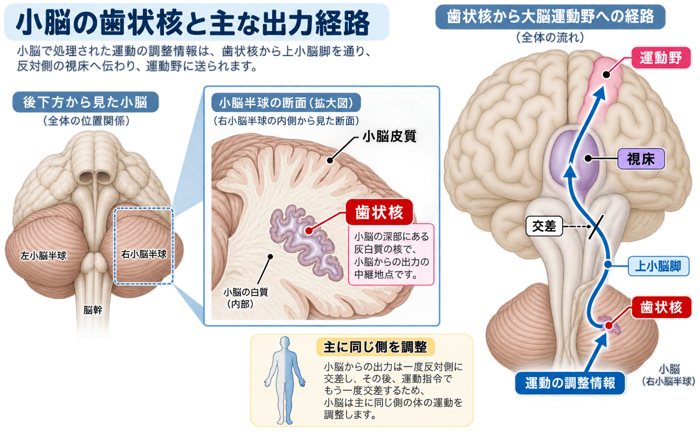

# 小脳歯状核

小脳歯状核（しょうのうしじょうかく）は、簡単にいうと、**小脳が調整した運動情報を大脳へ送り返すための中継所・出口**です。

## 図で位置と経路を確認する

## どこにある？

歯状核は小脳の表面ではなく、**小脳白質の奥深く**にあります。左右の小脳半球に1つずつあり、断面の輪郭が歯のようにギザギザしているため「歯状核」と呼ばれます。

> **小脳皮質＝表面で運動のずれを計算する場所** 
> **歯状核＝奥で修正情報を外へ送り出す場所**

## 何をしている？

歯状核は、主に手足を使う複雑な随意運動について、次のような要素の調節に関わります。

- 動く方向
- 力加減
- 動く速さ
- 動き出すタイミング

たとえば、コップを正確につかむ場合は、次のように考えます。

1. 大脳が「手をコップへ動かそう」と命令する。
2. 小脳皮質が、予定した運動と実際の動きのずれを計算する。
3. 歯状核が、修正した運動情報を小脳の外へ送る。
4. その情報が大脳へ戻り、運動が滑らかになる。

## 情報が通る主要経路

歯状核から大脳へ向かう主な流れは、次のとおりです。

**小脳皮質 → 歯状核 → 上小脳脚 → 反対側へ交差 → 視床 → 大脳の運動野**

歯状核から出た神経線維は、主に**上小脳脚**を通ります。その後、中脳で反対側へ交差し、視床を経由して大脳皮質へ向かいます。

国試では、**「歯状核からの出力は上小脳脚を通る」**ことが重要です。

## なぜ小脳は同じ側の手足を調整するのか？

歯状核から出る情報は、上小脳脚で反対側へ交差します。一方、大脳から脊髄へ下る運動命令も、途中で多くが反対側へ交差します。

つまり、全体では交差が2回起こるため、最終的に小脳は**主に小脳と同じ側の手足**を調整します。

## 4つの小脳核

小脳の奥には、代表的な4種類の小脳核があります。内側から外側へ並べると、次の順番です。

**室頂核 → 球状核 → 栓状核 → 歯状核**

| 小脳核 | 主な役割のイメージ |
|---|---|
| 室頂核 | 姿勢やバランス |
| 球状核・栓状核 | 手足の運動の途中修正 |
| 歯状核 | 複雑な随意運動の計画・調節 |

歯状核は、4つのうち**最も外側にあり、最も大きい小脳核**です。

## 最小限の暗記セット

> **歯状核＝小脳の奥にあるギザギザした核** 
> **複雑な随意運動を調節する** 
> **上小脳脚から出力する** 
> **交差して視床を通り、大脳へ向かう**

## 参考資料

- [Neuroanatomy, Dentate Nucleus｜NCBI Bookshelf](https://www.ncbi.nlm.nih.gov/books/NBK554381/)
- [Projections from the Cerebellum｜NCBI Bookshelf](https://www.ncbi.nlm.nih.gov/books/NBK11100/)
- [Anatomy, Central Nervous System｜NCBI Bookshelf](https://www.ncbi.nlm.nih.gov/books/NBK542179/)
