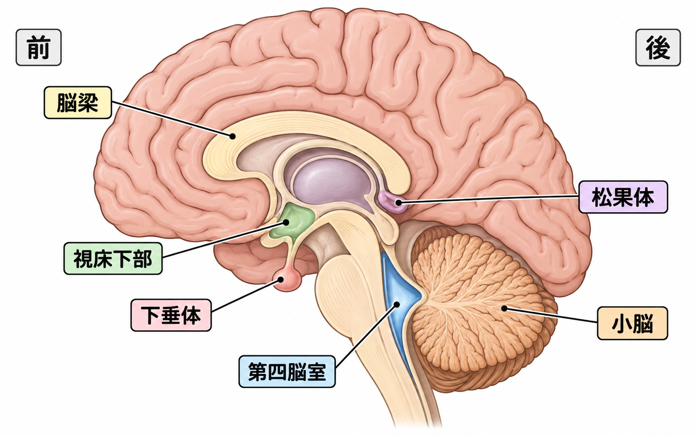

# 脳の主要部位を関連づけて覚える

脳梁・視床下部・下垂体・松果体・小脳・第四脳室を、ばらばらの単語として覚えるのは大変です。そこで、位置と役割を次の3グループにまとめます。

1. 左右をつなぐ「連絡橋」
2. 体内を調節する「司令室」
3. 運動と脳脊髄液に関わる「後方エリア」

## まず位置関係を見る

最初は、次の6行だけを頭の中の地図に置きます。

- 上に弓形の**脳梁**
- 中央下に**視床下部**
- 視床下部の下に**下垂体**
- 中央後ろに**松果体**
- 後頭部の下に**小脳**
- 小脳の前に**第四脳室**

## チャンク1：脳梁は左右をつなぐ連絡橋

脳梁は、大脳の中央にある弓形の神経線維の束です。右の大脳と左の大脳をつなぎ、感覚・運動・視覚などの情報を左右で共有させます。

**覚え方：脳梁は、左右の脳を渡る「橋梁」**

「梁」は建物を支える横木です。漢字そのものが、左右をつなぐ役割を表しています。

## チャンク2：視床下部・下垂体・松果体は体内調節チーム

### 視床下部：体内環境の司令官

視床下部は、名前のとおり**視床の下**にあり、その下には下垂体があります。小さな領域ですが、次のような体内の状態を監視・調節します。

- 体温
- 空腹と満腹
- のどの渇き
- 睡眠と覚醒
- 自律神経
- ホルモン
- ストレス反応
- 生殖に関する働き

**覚え方：視床「下」部は視床の下。さらに下へ下垂体をぶら下げる。**

### 下垂体：ホルモンの実行部隊

下垂体は、視床下部のすぐ下にある小さな器官です。視床下部からの指示に応じてホルモンを分泌し、成長、甲状腺、副腎皮質、生殖、母乳、体内の水分量などを調節します。

関係を一言で表すと、次のとおりです。

> **視床下部＝指示を考える上司** 
> **下垂体＝指示を実行する部下**

なお、下垂体後葉から放出される抗利尿ホルモンとオキシトシンは、視床下部で作られます。

### 松果体：体内時計の夜間モード係

松果体は、脳の中央付近で、第三脳室の後ろ側にあります。暗くなると**メラトニン**の分泌が増え、睡眠と覚醒のリズムを整えます。

**目が明るさを感じる → 視床下部の体内時計へ伝わる → 松果体へ伝わる → 夜にメラトニンが増える**

**覚え方：松果体の「松」は、夜に眠る森の松。**

## チャンク3：小脳・第四脳室は後方エリア

### 小脳：運動の調整係

小脳は後頭部の下側にあり、大脳の後ろ下に隠れるように位置します。運動を始める命令を出すのではなく、大脳の命令と実際の動きを比べて修正します。

- 運動を滑らかにする
- 力加減を調節する
- 動くタイミングを合わせる
- 姿勢を保つ
- バランスを取る
- 繰り返した運動を学習する

たとえばコップを取るときは、**大脳が「手を動かせ」と命令し、小脳が「少し速い」「もう少し右」と微調整する**イメージです。

**覚え方：小脳は運動の監督・コーチ。**

### 第四脳室：脳脊髄液が通る水の部屋

第四脳室は神経細胞の集まりではなく、**脳脊髄液が入っている空間**です。脳幹の後ろ、小脳の前にあります。

脳脊髄液のおおまかな流れは、次のとおりです。

**左右の側脳室 → 第三脳室 → 中脳水道 → 第四脳室 → 脳と脊髄の周囲**

**覚え方：第四脳室は、小脳の前・脳幹の後ろにある水槽。**

## 全部を一つの物語にする

脳を会社にたとえると、次のように整理できます。

| 部位 | 場所 | 役割のたとえ |
|---|---|---|
| 脳梁 | 左右の大脳の間 | 左右の本社をつなぐ連絡橋 |
| 視床下部 | 視床の下、下垂体の上 | 体内環境の司令官 |
| 下垂体 | 視床下部の下 | ホルモンの実行部隊 |
| 松果体 | 第三脳室の後ろ側 | 昼と夜を知らせる時計係 |
| 小脳 | 後頭部の下側 | 動作のミスを直す運動コーチ |
| 第四脳室 | 脳幹と小脳の間 | 脳脊髄液が通る水路の部屋 |

## 参考資料

- [Neuroanatomy, Corpus Callosum｜NCBI Bookshelf](https://www.ncbi.nlm.nih.gov/books/NBK448209/)
- [Functional Anatomy of the Hypothalamus and Pituitary｜NCBI Bookshelf](https://www.ncbi.nlm.nih.gov/books/NBK279126/)
- [Physiology, Pineal Gland｜NCBI Bookshelf](https://www.ncbi.nlm.nih.gov/books/NBK525955/)
- [Anatomy, Central Nervous System｜NCBI Bookshelf](https://www.ncbi.nlm.nih.gov/books/NBK542179/)
- [The Ventricular System｜NCBI Bookshelf](https://www.ncbi.nlm.nih.gov/books/NBK11083/)
